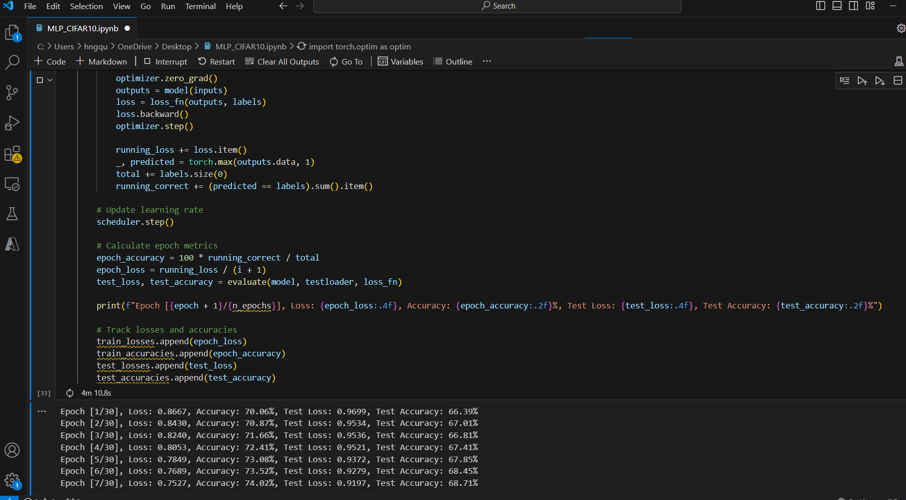

1. Công nghệ sử dung:

* flask, PIL, torch, torchvision, matplotlib, numpy, io

2. Thuật toán:

* MLP (Multilayer Perceptron): Mạng nơ-ron nhiều lớp giúp học các mô hình phi tuyến tính qua điều chỉnh trọng số.

Kết quả trả ra độ chính xác 

