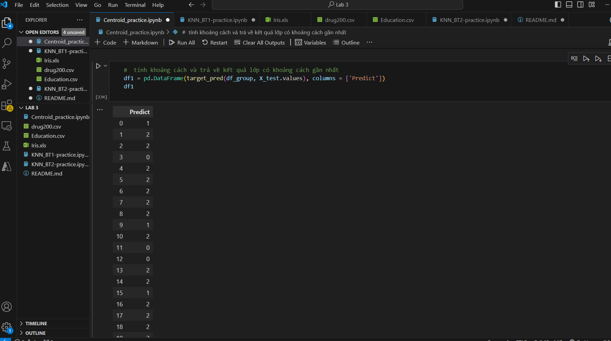
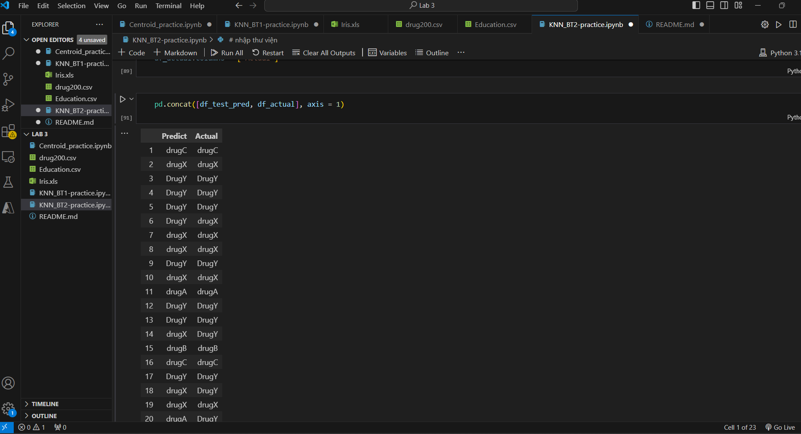

1. Thư viện được sử dụng

* pandas, numpy

2. Thuật toán: K-Nearest Neighbors và Centroid

* KNN là thuật toán học máy không giám sát cho phân loại và hồi quy, dựa trên nguyên tắc rằng các điểm dữ liệu tương tự gần nhau.
* Centroid là điểm trung tâm của một cụm dữ liệu trong phân tích cụm, thường được sử dụng trong thuật toán K-Means.

3. Đánh giá mô hình và kết quả dự đoán của 2 mô hình:

* Centroid

* KNN

